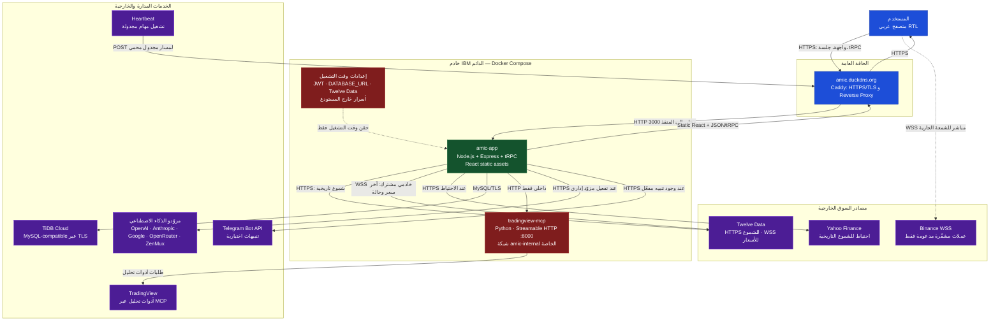

# سياق مشروع AMIC للنماذج الذكية

> **الغرض من هذه الوثيقة:** قدّم محتواها إلى أي نموذج ذكاء اصطناعي قبل سؤاله عن تطوير منصة AMIC أو مراجعة كودها أو اقتراح ميزات لها. وهي تصف الحالة الحالية الفعلية للمشروع وحدود نطاقه وقراراته المعمارية.

## 1. هوية المنصة

**AMIC** اختصار لـ **AI Market Intelligence & Confluence Platform**. هي منصة ويب عربية، باتجاه كتابة من اليمين إلى اليسار، تساعد المستخدم على قراءة الأسواق متعددة الأصول من خلال بيانات الأسعار، التحليل الفني، بنية السعر، التنبيهات، التداول الورقي، والمساعدة المدعومة بالذكاء الاصطناعي. المنصة أداة تحليلية وتعليمية؛ لا تقدّم توصيات استثمارية شخصية، ولا تنفّذ صفقات حقيقية، ولا ينبغي أن تعرض نتائجها على أنها ضمان للأداء أو الربح.

تخدم AMIC مستخدمين متعدّدين، ولكل مستخدم مساحة بيانات خاصة به، مثل صفقاته الورقية وإشاراته وتفضيلات طبقات الشارت وتنبيهات بنية السعر. يوجد دور إداري مستقل لإدارة إعدادات مزوّدي نماذج الذكاء الاصطناعي، ولا يجب أن يطّلع المستخدم العادي على مفاتيح المزوّدين أو بيانات مستخدمين آخرين.

| البند | الوصف |
|---|---|
| الواجهة | React 19 مع TypeScript وTailwind CSS 4 ومكوّنات shadcn/ui، بواجهة عربية RTL داكنة ومتجاوبة للهاتف والسطح. |
| الخادم | Node.js وExpress وtRPC 11، مع Drizzle ORM وقاعدة TiDB Cloud المتوافقة مع MySQL. |
| المخططات | `lightweight-charts` لرسم الشموع وطبقات التحليل التفاعلية. |
| الاستضافة | حاويات Docker Compose على خادم IBM دائم، أمام Caddy وHTTPS، على `https://amic.duckdns.org`. |
| المصادقة | بريد إلكتروني وكلمة مرور فقط، مع تجزئة bcrypt وجلسات موقّعة HMAC-SHA-256. لا تستخدم OAuth. |

## 2. الوظائف المتاحة حاليًا

### 2.1 مساحة العمل والتحليل الفني

تحتوي المنصة على لوحة نبضة السوق، صفحة تحليل فني، تحليل متعدد الأطر، ماسح سوق، تداول ورقي، سجل إشارات، ومساعد AMIC. يدعم اختيار الأصل من قائمة مع إمكانية الإدخال اليدوي، وتضم القائمة فئات العملات المشفّرة والأسهم والعملات الأجنبية والمعادن الثمينة. توفر المنصة أيضًا أدوات عرض مناسبة للشاشات الصغيرة، بما فيها شريط جانبي RTL ودرج هاتف مغلق تلقائيًا بعد اختيار أي عنصر تنقل.

في صفحة التحليل، تظهر قيمة السعر والإشارات الفنية المتاحة مثل RSI وMACD، إلى جانب مخطط شموع تفاعلي. تتوفر أزرار أطر زمنية سريعة تشمل الدقيقة والدقائق والساعات واليوم والأسبوع والشهر، مع الإفصاح بأن حداثة البيانات تعتمد على المزود وقد تكون مؤجلة أو مخزنة مؤقتًا في بعض الحالات.

### 2.2 بيانات السوق ومصادرها

لا تعتمد AMIC على بيانات مصطنعة أو لقطات ثابتة. مصدر الشموع التاريخية الأساسي متعدد الأصول هو **Twelve Data** من الخادم باستخدام مفتاح سري لا يظهر في المتصفح. يوجد احتياط عبر Yahoo Finance عندما لا تتوفر البيانات من المصدر الأساسي. وللعملات المشفّرة المدعومة، يستخدم المتصفح بث Binance WebSocket لتحديث الشموع الجارية بسرعة.

يوجد أيضًا مدير بث خادمي لـ Twelve Data يعتمد WebSocket ويعيد اتصالًا تدريجيًا عند الانقطاع. واجهة الشارت تعرض شارة عربية لحالة مزود البث حتى لا يفترض المستخدم أن كل البيانات لحظية دائمًا.

| حالة الشارة | المعنى المقصود للمستخدم |
|---|---|
| **مباشر / حي** | يوجد اتصال بث نشط للمزود المناسب. |
| **جارٍ الاتصال** | بدأ الاتصال ولم يصل بعد إلى حالة جاهزة. |
| **يعيد الاتصال** | انقطع الاتصال ويجري استعادته تلقائيًا بتدرج. |
| **متأخر / احتياطي** | البيانات معروضة من مسار غير لحظي أو احتياطي. |
| **غير متاح** | تعذر الاتصال بالمصدر الحي ويجب الإفصاح بوضوح عن ذلك. |

يجب عدم الخلط بين **مزود الشموع التاريخية** و**مزود البث الحي**: قد تأتي شموع أصل مثل الذهب من Twelve Data، بينما يكون بث Binance مخصصًا فقط للرموز المشفّرة المدعومة. عند تعديل الواجهة، يجب أن يكون اسم المزود في الشارة دقيقًا للأصل المحدد، وألا يوحي بأن Binance يغطي الذهب أو الأسهم أو الفوركس.

### 2.3 طبقات الشارت وبنية السعر

يدعم المخطط طبقات قابلة للتفعيل أو الإخفاء، وتحفظ التفضيلات لكل مستخدم. الطبقات الحالية هي SMA 20 وSMA 50، وEMA 12 وEMA 26، ومستويات الدعم والمقاومة، ومناطق الطلب والعرض، وأحداث الاختراق والكسر والانعكاس، والحجم عند توفره.

محرك بنية السعر مكتوب في TypeScript ويعمل على الشموع الفعلية. يستخرج القمم والقيعان، والمستويات البنيوية، ومناطق الطلب والعرض، وأحداث الاختراق وكسر البنية والانعكاس. كل منطقة أو حدث يجب أن يحمل تفسيرًا واضحًا ومعلومة إبطال أو مستوى مرجعي، لأن الهدف هو قراءة قابلة للمراجعة لا زخرفة بصرية غير مفسّرة.

تظهر كذلك إشارات تقاطع المتوسطات المتحركة، مثل التقاطع الذهبي وتقاطع الموت، في سجل الإشارات. هذه الإشارات وصفية ولا تعني أمر شراء أو بيع.

### 2.4 التنبيهات والتداول الورقي والمراقبة

يمكن للمستخدم إنشاء قواعد تنبيه لبنية السعر حسب الرمز والإطار ونوع الحدث، بما في ذلك الاختراق والكسر والانعكاس. التنبيهات معزولة حسب المستخدم، وتراقب دوريًا، ويمكن أن تنتج إشعارات داخل المنصة وإشعارات تيليغرام عندما يكون الربط مفعّلًا. يحتفظ النظام بسجل تدقيقي لمنع الإطلاق المتكرر ولمراجعة جودة الإشارة لاحقًا.

يدعم التداول الورقي فتح الصفقات وإغلاقها وحساب الربح والخسارة دون الاتصال بوسيط أو تنفيذ أموال حقيقية. كما يمكن حفظ الإشارات التحليلية في سجل خاص بالمستخدم.

تتضمن لوحة التحكم أداة لمراقبة الذهب والفضة، مع تغيرات سعرية ومخططات Sparkline يومية أو أسبوعية، وبطاقات قابلة للنقر تفتح تحليلًا فنيًا تفصيليًا وتنبيهات أسعار معزولة للمستخدم.

### 2.5 الذكاء الاصطناعي والإدارة

توجد واجهة إدارية لإدارة مزوّدي نماذج الذكاء الاصطناعي، وتشمل OpenAI وAnthropic وGoogle وOpenRouter وZenMux والمزودين المتوافقين مع واجهة OpenAI عبر عنوان Base URL مخصص. تحفظ المفاتيح بعد تشفير AES-256-GCM، ويمكن اختبار الاتصال بالمفتاح قبل الحفظ وجلب قائمة النماذج المتاحة لعرضها في قائمة اختيار.

المساعد الذكي في المنصة يفسر بيانات التحليل الفني ضمن سياق تعليمي. عند اقتراح أي تحسين، يجب الحفاظ على عبارة الإفصاح بأن المحتوى معلوماتي وتعليمي وليس نصيحة استثمارية.

## 3. استخدام tradingview-mcp

تعيد AMIC استخدام مشروع **tradingview-mcp** المفتوح المصدر كخدمة Python منفصلة، ولا تبني خادم MCP بديلًا من الصفر. تعمل الخدمة داخل حاوية غير مكشوفة للإنترنت، ويستدعيها خادم Node.js داخليًا عبر شبكة Docker. دورها هو الاستعلامات التحليلية وما يتصل بأدوات TradingView المتاحة ضمن المشروع؛ ليست مصدر الشموع التاريخية أو البث الأساسي للشارت.

لا ينبغي تغيير هذا القرار دون طلب صريح من مالك المشروع. وإذا احتاج نموذج ذكاء اصطناعي إلى اقتراح ميزات مخطط جديدة، فعليه أن يقترحها فوق بيانات الشموع الموحدة في AMIC، لا أن يفترض إمكان سحب تاريخ الشموع مباشرة من TradingView.

## 4. قرارات نطاق صريحة

| القرار | التوجيه الواجب احترامه |
|---|---|
| Pine Script وICT/SMC | كان هناك اقتراح لتحويل مؤشرات Pine Script، لكن المالك ألغى هذا المسار. لا تُدمج منطق FVG أو Order Blocks أو السيولة أو Confluence Score من Pine Script إلا بطلب جديد وصريح. |
| الأمان | لا تضع أي مفتاح API أو كلمة مرور أو JWT في الواجهة أو المستودع أو السجلات. يجب أن يرفض التطبيق الإقلاع إذا غاب `JWT_SECRET` الآمن، بلا قيمة افتراضية. |
| بيانات المستخدم | أي بيانات شخصية أو تداولية أو تنبيهات أو تفضيلات يجب أن تكون معزولة بـ `userId`، مع فرض الصلاحية من الخادم لا من الواجهة فقط. |
| المصادر | لا تصطنع أسعارًا أو شموعًا أو مراجعات أو تقييمات أو نتائج تداول. يجب الإفصاح عند استخدام احتياط أو كاش أو بيانات متأخرة. |
| تجربة المستخدم | الواجهة عربية RTL أولًا، متجاوبة للهاتف، وتظهر حالات التحميل والخطأ والمزود بوضوح. |
| الاختبارات | أي تعديل سلوكي أو أمني يجب أن يتضمن اختبارات Vitest مناسبة، ثم فحص TypeScript وبناء الإنتاج قبل النشر. |

## 5. مخطط قاعدة البيانات التفصيلي

تستخدم AMIC قاعدة **TiDB Cloud** المتوافقة مع MySQL، ويُعرّف مخططها المصدرّي في `drizzle/schema.ts`. تحتوي القاعدة الحالية على **12 جدولًا**. قاعدة البيانات هي مصدر الحقيقة للهوية والبيانات الشخصية والإعدادات والتنبيهات والصفقات الورقية، أما شموع السعر الحية والتاريخية فتُجلب من مزودي السوق ولا تُخزن كنسخ دائمة في جداول المستخدمين.

### 5.1 خريطة العلاقات

```mermaid
erDiagram
    USERS ||--o{ WATCHLISTS : "يملك"
    USERS ||--o{ PAPER_TRADES : "يفتح"
    USERS ||--o{ SAVED_SIGNALS : "يحفظ"
    USERS ||--o{ METAL_ALERTS : "ينشئ"
    USERS ||--o{ STRUCTURE_ALERTS : "ينشئ"
    USERS ||--o{ USER_NOTIFICATIONS : "يتلقى"
    USERS ||--o| USER_TELEGRAM_SETTINGS : "يضبط"
    USERS ||--o| CHART_PREFERENCES : "يضبط"
    USERS ||--o{ AI_PROVIDER_SETTINGS : "يحدّث إداريًا"

    USERS {
      int id PK
      varchar email UK
      varchar passwordHash
      enum role
    }
    WATCHLISTS {
      int id PK
      int userId FK
      varchar symbol
      varchar exchange
    }
    PAPER_TRADES {
      int id PK
      int userId FK
      enum status
      decimal entryPrice
      decimal realizedPnl
    }
    SAVED_SIGNALS {
      int id PK
      int userId FK
      enum recommendation
      json analysisPayload
    }
    METAL_ALERTS {
      int id PK
      int userId FK
      enum status
      decimal targetPrice
    }
    STRUCTURE_ALERTS {
      int id PK
      int userId FK
      enum eventType
      enum status
    }
    USER_NOTIFICATIONS {
      int id PK
      int userId FK
      enum category
      json metadata
    }
    USER_TELEGRAM_SETTINGS {
      int userId PK_FK
      varchar chatId
      int enabled
    }
    CHART_PREFERENCES {
      int userId PK_FK
      json layers
    }
    AI_PROVIDER_SETTINGS {
      int id PK
      int updatedByUserId FK
      varchar provider UK
      text encryptedApiKey
    }
```

يوضح المخطط العلاقات المرجعية الفعلية. توجد كذلك جداول تشغيلية لا تتبع مستخدمًا بعينه: `marketSnapshots` لتخزين كاش بيانات السوق العامة، و`metalAlertMonitorSettings` لتخزين معرّف مهمة المراقبة المجدولة الوحيدة. لا ينبغي ربطهما بـ `userId` أو التعامل معهما كسجلّين خاصين بمستخدم.

### 5.2 جدول `users` — الهوية والصلاحيات

هذا هو الجدول الأب لجميع البيانات المملوكة للمستخدم. المسار المعتمد حاليًا هو البريد وكلمة المرور؛ حقلا `openId` و`loginMethod` موجودان للتوافق مع صفوف قديمة ولا يعنيان أن OAuth جزء من تجربة الدخول الحالية.

| الحقل | النوع والقيود | المعنى وقاعدة الاستخدام |
|---|---|---|
| `id` | `INT`، مفتاح أساسي، زيادة تلقائية | معرّف الملكية الداخلي المرجعي من بقية الجداول. |
| `email` | `VARCHAR(320)`، فريد، قابل للفراغ على الصفوف القديمة | هوية تسجيل الدخول الحالية؛ لا تسمح بإنشاء مستخدمين جدد ببريد مكرر. |
| `passwordHash` | `VARCHAR(255)`، قابل للفراغ للتوافق | تجزئة bcrypt فقط، ولا تحفظ كلمة مرور صريحة مطلقًا. |
| `role` | `ENUM('user','admin')`، افتراضي `user` | يفرض الخادم صلاحيات الإدارة، ولا يكفي إخفاء زر الإدارة في الواجهة. |
| `openId` | `VARCHAR(64)`، فريد، قابل للفراغ | حقل إرثي متوافق مع بيانات قديمة، وليس مسار مصادقة جديد. |
| `name` و`loginMethod` | نصوص اختيارية | بيانات وصفية أو متوافقة مع الإرث. |
| `createdAt` و`updatedAt` و`lastSignedIn` | طوابع زمنية | تدقيق دورة حياة الحساب؛ `updatedAt` يتغير تلقائيًا. |

عند حذف مستخدم، تحذف البيانات التابعة ذات العلاقة الخارجية بإجراء `CASCADE`، باستثناء `aiProviderSettings.updatedByUserId` الذي يتحول إلى `NULL` ليبقى سجل إعداد المزوّد دون الاحتفاظ بمرجع مستخدم محذوف.

### 5.3 الجداول المملوكة للمستخدم

كل جدول في هذا القسم يجب الوصول إليه على الخادم باستخدام `userId` من الجلسة الموثقة، لا باستخدام قيمة يرسلها المتصفح بوصفها مصدر صلاحية.

| الجدول | المفتاح والملكية | أهم الحقول | القيود والسلوك |
|---|---|---|---|
| `watchlists` | `id`؛ `userId → users.id` | `symbol`، `exchange`، `assetClass` | فهرس ملكية على `userId` وقيد فريد على `(userId, symbol, exchange)` يمنع تكرار نفس الأصل في قائمة المستخدم. `assetClass`: `crypto` أو `stock` أو `forex` أو `futures`. |
| `paperTrades` | `id`؛ `userId → users.id` | الأصل، الاتجاه، الكمية، أسعار الدخول/الخروج، وقف الخسارة، جني الربح، الربح/الخسارة | `side`: `long|short`؛ `status`: `open|closed`. الأرقام المالية `DECIMAL(24,8)` وليست أعدادًا عائمة. لا تُغلق الصفقة إلا مع الشرط `(id, userId, status='open')`، وتُحسب `realizedPnl` على الخادم. |
| `savedSignals` | `id`؛ `userId → users.id` | الرمز، البورصة، الإطار، التوصية، الثقة، الملخص، `analysisPayload` | `recommendation`: `strong_buy|buy|neutral|sell|strong_sell`. `analysisPayload` سجل JSON للتحليل المولد وقت الحفظ، وليس وعدًا بنتيجة تداول. |
| `metalAlerts` | `id`؛ `userId → users.id` | `metal`، `direction`، `targetPrice`، حقول التفعيل | المعدن محصور في `XAUUSD|XAGUSD`؛ الاتجاه `above|below`؛ الحالة `active|triggered|cancelled`. يحتفظ بتفاصيل السعر والوقت عند التفعيل. |
| `structureAlerts` | `id`؛ `userId → users.id` | الرمز، البورصة، الإطار، نوع الحدث، نتيجة المراقبة | الإطار محصور في `5m|15m|1h|4h|1d|1wk`؛ الحدث `breakout|breakdown|bullish_reversal|bearish_reversal`؛ الحالة `active|triggered|cancelled`. تحفظ النتيجة `triggeredPrice` و`triggeredEventKey` و`qualityScore` ووقت التفعيل. |
| `userNotifications` | `id`؛ `userId → users.id` | `category`، العنوان، المحتوى، `metadata`، `readAt` | النوع `metal_alert|structure_alert`. جدول رسائل داخلية لا يخلط بيانات مستخدمين؛ حالة عدم القراءة هي `readAt = NULL`. يسترجع التطبيق أحدث 20 رسالة للمستخدم. |
| `userTelegramSettings` | `userId` مفتاح أساسي وخارجي | `chatId`، `enabled`، `updatedAt` | علاقة واحد إلى واحد مع المستخدم. يُستخدم upsert؛ لا يجوز تفعيل الإرسال إذا كان `chatId` فارغًا. |
| `chartPreferences` | `userId` مفتاح أساسي وخارجي | `layers`، `updatedAt` | علاقة واحد إلى واحد مع المستخدم. JSON `layers` يحتوي مفاتيح منطقية: `sma`, `ema`, `levels`, `zones`, `events`, `volume`. تُكمل القيم الناقصة بالقيم الافتراضية في الخادم. |

### 5.4 جداول الإدارة والكاش والتشغيل

هذه الجداول ليست بيانات مستخدم اعتيادية، ولذلك تختلف قواعد الوصول إليها. لا تعرّضها tRPC للمستخدم العادي بلا إجراء إداري أو خادمي مناسب.

| الجدول | الغرض | الحقول الجوهرية | القيود وقاعدة التعامل |
|---|---|---|---|
| `aiProviderSettings` | إعداد مزوّدي نماذج الذكاء الاصطناعي على مستوى المنصة | `provider`، `encryptedApiKey`، `keyHint`، `model`، `customBaseUrl`، `maxOutputTokens`، `enabled`، `isActive`، `updatedByUserId` | `provider` فريد. المفتاح مخزن مشفرًا فقط ولا يعاد للعميل. يتم تغيير المزود النشط داخل معاملة إدارية تزيل تفعيل أي مزود نشط آخر؛ لذا الهدف التشغيلي هو مزود واحد مفعّل ونشط. `updatedByUserId` حقل تدقيق اختياري. |
| `marketSnapshots` | كاش بيانات سوق عامة لتخفيف طلبات المصدر الخارجي | `cacheKey`، السوق، البورصة، الإطار، `payload`، وقت الجلب والانتهاء | `cacheKey` فريد و`payload` JSON غير مملوك لمستخدم. تقرأ الخدمة السجل فقط إذا كان `expiresAt` مستقبلًا، وتستخدم upsert لتحديثه. يوجد فهرس انتهاء على `expiresAt`. |
| `metalAlertMonitorSettings` | إعداد تشغيلي منفرد لمراقب تنبيهات المعادن المجدول | `id`، `scheduleTaskUid`، الطوابع الزمنية | سجل شبه منفرد باستخدام `id = 1`، و`scheduleTaskUid` فريد. ليس جدول إعدادات لكل مستخدم. |

### 5.5 الفهارس والقيود المهمة

| المجال | الفهرس أو القيد | السبب |
|---|---|---|
| قوائم المستخدم | فهارس `userId` وتراكيب مثل `(userId, status)` و`(userId, createdAt)` | تسريع عرض صفقات وإشارات وتنبيهات مستخدم واحد دون مسح بيانات الجميع. |
| المراقبة المجدولة | فهرسا `(status, metal)` و`(status, exchange, symbol, interval)` | تحميل التنبيهات النشطة فقط وتجميع فحصها بكفاءة. |
| الإشعارات | `(userId, readAt, createdAt)` | عرض الإشعارات الحديثة وغير المقروءة لكل مستخدم. |
| كاش السوق | `cacheKey` فريد و`expiresAt` مفهرس | استبدال اللقطة نفسها والبحث السريع عن صلاحيتها. |
| مزود الذكاء الاصطناعي | `provider` فريد و`(isActive, enabled)` مفهرس | منع تكرار إعداد المزوّد وجلب المزوّد الفعال بسرعة. |

### 5.6 قواعد العزل والنزاهة التي يجب أن يلتزم بها أي كود جديد

> **قاعدة أساسية:** لا توجد سياسة عزل صفوف تلقائية في واجهة العميل. العزل مفروض في إجراءات الخادم باستعمال `ctx.user.id` ثم شرط `WHERE userId = ctx.user.id` في كل قراءة أو تعديل أو حذف لبيانات المستخدم.

عند إضافة إجراء لجدول شخصي، يجب أن يتضمن شرط الملكية في العملية نفسها. المثال الصحيح لإغلاق صفقة هو الاستعلام والتحديث معًا على `id` و`userId`، لا جلب الصفقة بالـ `id` ثم افتراض أن الواجهة لم تتلاعب به. استخدم مفاتيح خارجية مع `CASCADE` للبيانات الشخصية الجديدة ما لم توجد حاجة تدقيقية صريحة للاحتفاظ بسجل دون مستخدم.

يجب استخدام `DECIMAL` لكل مبلغ أو كمية أو سعر أو ربح/خسارة، وتطبيع الرمز والبورصة إلى أحرف كبيرة عند الإدخال. لا تضف JSON بلا عقد تحقق: الحقول الحالية ذات طبيعة JSON هي `analysisPayload` و`marketSnapshots.payload` و`userNotifications.metadata` و`chartPreferences.layers`. يجب أن يبقى محتوى `metadata` الخاص بالإشعار قليلًا وقابلاً للتفسير؛ قد يحوي معرف التنبيه والرمز والاتجاه والسعر والوقت ودرجة الجودة، لكنه ليس بديلًا عن جدول علائقي جديد إذا احتاج النظام لاحقًا استعلامات أو علاقات صارمة.

### 5.7 دورات الحياة والآثار الجانبية

| الكيان | الانتقال | الأثر المرافق |
|---|---|---|
| `paperTrades` | `open → closed` | يحفظ سعر الخروج ووقت الإغلاق و`realizedPnl`، ولا يسمح بإغلاق ثانٍ. |
| `metalAlerts` | `active → triggered` أو `cancelled` | تسجل المراقبة السعر والوقت، ثم تُنشئ `userNotifications` من فئة `metal_alert` وقد ترسل تيليغرام عند تفعيل إعداد المستخدم. |
| `structureAlerts` | `active → triggered` أو `cancelled` | تسجل السعر ومفتاح الحدث ودرجة الجودة والوقت، ثم تنشئ إشعار `structure_alert` وقد ترسل تيليغرام. |
| `userNotifications` | غير مقروء → مقروء | يكتب `readAt` مرة واحدة ضمن شرط أن تكون القيمة `NULL`. |
| `chartPreferences` و`userTelegramSettings` | إنشاء أو تعديل | تستخدم عمليات upsert على `userId`؛ يوجد سجل واحد فقط لكل مستخدم. |
| `marketSnapshots` | غير صالح → مجدد | يستبدل الكاش بالـ upsert مع تحديث `payload` و`fetchedAt` و`expiresAt`. |

تجدر الملاحظة أن الإشعارات لا تحمل مفتاحًا خارجيًا مباشرًا إلى `metalAlerts` أو `structureAlerts`؛ المرجع إلى التنبيه يكون في `metadata.alertId`. هذا يحقق أثرًا تدقيقيًا خفيفًا، لكنه يعني أنه إذا تطلبت الميزات الجديدة انضمامات تحليلية أو تقارير متقدمة بين التنبيه والإشعار، فالأفضل إضافة عمود علائقي صريح وترحيل واضح بدل البحث داخل JSON.

### 5.8 تعليمات مخطط البيانات للنموذج الذكي

```text
لا تغيّر مخطط AMIC بافتراضات عامة. ابدأ دائمًا من drizzle/schema.ts. كل بيانات المستخدم الشخصية تستخدم users.id كـ userId ومحمية في الخادم بشرط ملكية ضمن WHERE. لا تجعل userId قابلاً للثقة إذا أتى من المتصفح. استخدم DECIMAL للأسعار والكميات، وCASCADE لبيانات المستخدم الجديدة عند الحاجة، وقيود ENUM المتوافقة مع القيم الحالية.

الجداول العالمية هي marketSnapshots وaiProviderSettings وmetalAlertMonitorSettings؛ لا تضف لها userId عشوائيًا. aiProviderSettings إدارية فقط وتخزن API key مشفرًا؛ لا تعيد encryptedApiKey أو تفكه في العميل. userTelegramSettings وchartPreferences هما سجل واحد لكل مستخدم باستخدام userId كمفتاح أساسي وupsert.

قبل أي تغيير بنيوي: عدّل drizzle/schema.ts، أنشئ migration، راجع SQL، وطبقه عبر أداة SQL المخصصة. حدّث helpers الخادمية واختبارات Vitest، ولا تضف جدولًا أو عمودًا دون تبرير علاقة وملكية وفهرس واستراتيجية حذف واضحة.
```

## 6. نموذج البيانات ومفردات المجال

استخدم المفردات التالية باستمرار عند مناقشة المشروع أو كتابة الكود:

| المصطلح | المعنى في AMIC |
|---|---|
| Candle | شمعة OHLCV بتاريخ/وقت، وسعر افتتاح وأعلى وأدنى وإغلاق، وحجم اختياري. |
| Candle provider | مصدر الشموع التاريخية، حاليًا Twelve Data أساسي وYahoo Finance احتياطي. |
| Live quote provider | مزود آخر سعر أو تحديث حي، مثل Binance WebSocket أو مدير Twelve Data الخادمي. |
| Market structure | ناتج القمم والقيعان والمستويات والمناطق والأحداث التفسيرية. |
| Structure alert | قاعدة شخصية تراقب حدثًا بنيويًا لرمز وإطار محددين. |
| Chart preferences | إعدادات طبقات الشارت المحفوظة لكل مستخدم. |
| Paper trade | صفقة محاكاة لا تنفذ أمرًا حقيقيًا لدى وسيط. |

## 7. الرسم المعماري والبنية التحتية

يوضح الرسم التالي مسارات البيانات الفعلية في AMIC. توجد نقطة دخول عامة واحدة عبر نطاق DuckDNS وطبقة Caddy؛ أما خدمة `tradingview-mcp` فلا تملك منفذًا عامًا وتبقى ضمن شبكة Docker الداخلية. لا يجب أن يغيّر أي اقتراح مستقبلي هذا الحد أو يعرض MCP أو قاعدة البيانات مباشرة للإنترنت.



### 7.1 طبقات التشغيل وحدود الثقة

| الطبقة | المكونات | الوظيفة | الحد الأمني الذي لا يجب تجاوزه |
|---|---|---|---|
| العميل | React 19 و`lightweight-charts` في المتصفح | يعرض الواجهة RTL، يرسل طلبات tRPC، ويرسم الشموع والطبقات. | لا يحتفظ بمفتاح Twelve Data أو مفاتيح الذكاء الاصطناعي أو `JWT_SECRET`، ولا يقرر صلاحية المستخدم بنفسه. |
| الحافة العامة | DuckDNS وCaddy | استقبال HTTPS، إنهاء TLS، وتمرير الطلب إلى التطبيق فقط. | لا يمرر Caddy أي طلب عام إلى قاعدة البيانات أو إلى خدمة MCP. |
| التطبيق | `amic-app`، Express، tRPC، Drizzle | المصادقة، فرض الدور والملكية، منطق السوق، إدارة التنبيهات، تقديم الأصول الثابتة، واستدعاء الخدمات الخارجية. | جميع عمليات البيانات الشخصية تستخدم هوية الجلسة الخادمية، لا `userId` القادم من العميل. |
| الشبكة الخاصة | `amic-internal` و`tradingview-mcp` | تمكين Node.js من استدعاء أدوات TradingView عبر MCP. | لا يوجد نشر للمنفذ `8000` نحو الإنترنت؛ لا يتصل العميل مباشرة بـ MCP. |
| البيانات | TiDB Cloud | تخزين الهوية، الإعدادات، التنبيهات، الصفقات الورقية، الكاش، وسجل الإشعارات. | الاتصال من التطبيق فقط وبـ TLS؛ لا ترسل بيانات مستخدم إلى مزودي السوق أو الذكاء الاصطناعي إلا عند الحاجة المقصودة. |
| الخدمات الخارجية | Twelve Data وYahoo Finance وBinance وTradingView ومزوّدو LLM وTelegram | توفير السوق والبث والتحليل والتنبيهات والمساعدة الذكية. | عالج الفشل كحالة واضحة للمستخدم، ولا تتحول إلى بيانات مصطنعة أو تدّعِ حداثة غير متاحة. |
| التشغيل الدوري | Heartbeat إلى مسار مجدول محمي في التطبيق | فحص تنبيهات المعادن؛ تنبيهات بنية السعر لها مراقب خادمي منفصل ضمن التطبيق. | يجب أن تبقى المسارات المجدولة محددة وصالحة ومحمية من التشغيل غير المصرح به. |

### 7.2 تدفقات البيانات الرئيسة

| التدفق | المسار | البروتوكول والسلوك | ملاحظة تنفيذية للنموذج الذكي |
|---|---|---|---|
| تسجيل الدخول والجلسة | المتصفح ← Caddy ← `amic-app` | HTTPS؛ كلمة مرور تتحقق في الخادم، ثم كوكي جلسة موقّعة. | لا تعيد OAuth، ولا تضع التوقيع أو كلمة المرور أو المفاتيح في الواجهة. |
| الشموع التاريخية | المتصفح ← tRPC ← `amic-app` ← Twelve Data، ثم Yahoo Finance عند الحاجة | HTTPS من التطبيق إلى المزود؛ التخزين المؤقت يقلل الطلبات. | أظهر مصدر الشموع الفعلي، واعلن استخدام الاحتياط أو التأخير بدلاً من إخفائه. |
| السعر الحي متعدد الأصول | المتصفح ← tRPC دوري ← `amic-app` ← WSS Twelve Data | الخادم يفتح الاتصال المشترك عند أول طلب للرمز، يحفظ آخر سعر، ويعيده للواجهة مع الحالة `connecting/live/reconnecting/delayed/unavailable`. | لا تفتح اتصال Twelve Data مستقلًا من كل متصفح ولا تكشف مفتاحه. |
| التحديث الحي للكريبتو | المتصفح ← WSS Binance | بث مباشر من المتصفح لأزواج Binance المدعومة فقط، يحدّث الشمعة الجارية. | لا تعمم اسم Binance على الذهب أو الأسهم أو الفوركس. |
| تحليل TradingView | المتصفح ← tRPC ← `amic-app` ← MCP داخلي ← TradingView | tRPC/HTTP إلى Node، ثم Streamable HTTP على شبكة Docker، ثم استدعاءات الخدمة الخارجية. | لا تستخدم TradingView كمصدر شموع الشارت ولا تكشف MCP للعامة. |
| تنبيه مفعّل | Heartbeat أو المراقب ← `amic-app` ← TiDB، ثم إشعار داخلي/Telegram عند التفعيل | مسار مجدول يقرأ التنبيهات النشطة ويكتب النتيجة مرة واحدة لتفادي التكرار. | احفظ الملكية والسجل التدقيقي، ولا ترسل تيليغرام إن لم يفعّل المستخدم الإعداد ويحدد `chatId`. |
| المساعد الذكي | المتصفح ← tRPC ← `amic-app` ← المزوّد النشط | مفتاح المزوّد يفك على الخادم فقط بعد أن يكون مخزنًا مشفرًا في TiDB. | حافظ على الإفصاح التعليمي، ولا تحوّل المخرجات إلى توصيات شخصية أو أوامر تداول. |

### 7.3 تعليمات البنية التحتية للنموذج الذكي

```text
اعتبر Caddy بوابة HTTPS العامة الوحيدة وamic-app نقطة منطق الأعمال الوحيدة. لا تعرض TiDB أو tradingview-mcp أو ملفات الأسرار أو منافذ Docker مباشرة للإنترنت. كل تكامل خارجي يمر من الخادم ما عدا Binance WebSocket للرموز المشفرة المدعومة؛ لا تخلط هذا الاستثناء مع بقية الأصول.

عند تعديل السوق أو البث، ميّز بين شموع تاريخية من Twelve Data/Yahoo، وسعر حي يمر من مدير Twelve Data الخادمي، وبث Binance المباشر في المتصفح. أظهر اسم المزود وحالة الاتصال بصدق. عند تعديل التنبيهات، حافظ على المسارات المجدولة والملكية وكتابة إشعار قابل للتدقيق دون إطلاق مكرر.

لا تضع أسرارًا في Dockerfile أو JavaScript المبني أو سجلات التطوير. أبقِ tradingview-mcp على شبكة amic-internal، واستعمل الحاوية Node.js كوسيط صلاحيات وتدقيق لكل وصول إلى قاعدة البيانات أو إلى مزوّدات LLM.
```

## 8. دليل تشغيل مختصر للحاويات والنسخ الاحتياطي

> **حدود هذا الدليل:** هو مرجع تشغيل مختصر لخادم IBM الدائم، حيث يقع نشر الحاويات في `/opt/amic-platform`. لا تطبع قيم الأسرار، ولا تنسخ ملفات الأسرار إلى Git أو محادثة أو سجل أو أرشيف غير مشفّر. تُدار مفاتيح التطبيق من مدير أسرار المنصة وإعداد إنتاجي محمي خارج المستودع، لا من الواجهة ولا من ملفات مصدر عامة.

### 8.1 فحص يومي وسلامة الخدمة

نفّذ أوامر الفحص من الخادم في مجلد Compose. لا تستخدم `docker compose config` دون حماية للمخرجات إذا كان قد يوسّع قيم الأسرار.

```bash
cd /opt/amic-platform

# يجب أن تكون amic-app عاملة وأن تصبح tradingview-mcp بحالة healthy.
docker compose ps

# راقب آخر الرسائل فقط، ولا تطبع متغيرات البيئة.
docker compose logs --tail=150 amic-app tradingview-mcp

# تحقق من الوصول العام عبر TLS؛ النتيجة المتوقعة 200 أو إعادة توجيه مقصودة.
curl -fsS -o /dev/null -w '%{http_code}\n' https://amic.duckdns.org

# تحقق من قابلية خدمة MCP للوصول داخليًا من التطبيق، دون كشف الرابط أو الأسرار العامة.
docker compose exec amic-app node -e "fetch(process.env.MCP_SERVICE_URL).then(r => { if (!r.ok) process.exit(1); console.log(r.status) }).catch(() => process.exit(1))"
```

| فحص | الحالة السليمة | التصرف عند الفشل |
|---|---|---|
| `amic-app` | `running` أو `Up` | راجع سجلات التطبيق؛ تحقق من الاتصال بـ TiDB ومن توافر `JWT_SECRET` وملفات الأسرار من دون عرض القيم. |
| `tradingview-mcp` | `healthy` | راجع سجل الحاوية، ثم أعد تشغيلها فقط إذا فشل الفحص الصحي بعد فترة البدء. لا تنشر المنفذ `8000`. |
| HTTPS | `200` أو تحويل HTTPS متوقع | تحقق من Caddy وDNS وشهادة TLS؛ لا تحوّل التطبيق العام إلى HTTP لتجاوز المشكلة. |
| السوق والبث | اسم المزود وحالة الشارة متسقان مع الأصل | افصل بين شموع Twelve Data واحتياط Yahoo وبث Binance الخاص بالعملات المشفّرة. |

### 8.2 تشغيل وإعادة تشغيل متحكم بها

إعادة تشغيل التطبيق لا تتطلب إعادة بناء إن لم يتغير الكود أو متغيرات البناء. ابدأ بالخيار الأقل تأثيرًا، ثم تحقق من الحالة العامة بعد كل خطوة.

```bash
cd /opt/amic-platform

# إعادة تشغيل التطبيق فقط بعد عطل عابر.
docker compose restart amic-app

# إظهار حالة الخدمات ومتابعة سجل التطبيق بعد الإعادة.
docker compose ps
docker compose logs --tail=100 amic-app

# تحديث مقصود بعد مراجعة التغيير والمصادر، ثم بناء وتشغيل الحاويات.
git pull --ff-only
docker compose up -d --build
docker compose ps
```

يجب ألّا يعاد تشغيل `tradingview-mcp` أو Caddy كإجراء افتراضي لمشكلة واجهة في التطبيق؛ ذلك يوسّع نطاق الأثر بلا ضرورة. وعند تغيير إعداد Caddy، تحقق من صحة ملفه ثم أعد تحميله بدل إيقافه:

```bash
sudo caddy validate --config /etc/caddy/Caddyfile
sudo systemctl reload caddy
```

قبل أي تحديث أكبر، احفظ نقطة استعادة في المشروع عبر checkpoint موثّق. عند الحاجة إلى التراجع عن كود المشروع، استخدم نسخة checkpoint سليمة وأعد نشرها؛ لا تستخدم `git reset --hard` على نسخة تشغيلية ولا تحذف الحاويات أو الأحجام عشوائيًا.

### 8.3 سياسة النسخ الاحتياطي

تتوزع البيانات الحساسة بين TiDB Cloud وإعدادات تشغيل الخادم. لا يكفي أخذ نسخة من الحاوية لأن قاعدة البيانات خارجها، ولا يكفي نسخ قاعدة البيانات لأن الوصول إلى الخدمة يعتمد كذلك على ملفات Compose وإعداد Caddy وإدارة الأسرار.

| الأصل | مصدر الحقيقة | سياسة النسخ أو الحفظ | ممنوعات |
|---|---|---|---|
| بيانات المستخدمين والتنبيهات والصفقات والتفضيلات | TiDB Cloud | فعّل النسخ أو التصدير المجدول وفق سياسة حساب TiDB، وحدد فترة احتفاظ، واختبر استعادة إلى نسخة غير إنتاجية دوريًا. | لا تحفظ تفريغًا يتضمن بيانات شخصية في مسار عام أو دون تشفير. |
| كود AMIC وتعريف Compose | مستودع Git + checkpoint المشروع | استخدم فروعًا محمية وcheckpoints موصوفة؛ احتفظ بأرشيف مصدر مُستبعد منه الأسرار كنسخة طوارئ. | لا تضف `.env` أو ملفات مفاتيح أو أرشيفات بناء كبيرة إلى Git. |
| إعداد Caddy وDuckDNS | خادم الإنتاج/مدير DNS | احتفظ بنسخة مشفّرة ومقيدة الوصول من إعداد Caddy وبيانات إدارة DNS، وسجل آخر تغيير وتاريخه. | لا تنسخ رموز DuckDNS إلى الوثائق أو السجل أو مستودع الكود. |
| الأسرار التشغيلية | مدير الأسرار وإعداد إنتاجي محمي | احتفظ بملكية وصول موثقة وخطة استرجاع محمية؛ دوّن **أسماء المتغيرات فقط** في الدليل. | لا تطبع `DATABASE_URL` أو مفاتيح Twelve Data أو JWT أو Telegram أو LLM. |

لإنشاء أرشيف مصدر طوارئ لا يحتوي الأسرار، استخدم وجهة محمية على الخادم، ثم انقله إلى مخزن خارج الخادم مشفّر. عدّل قائمة الاستثناءات لتتوافق مع ملفات الأسرار الفعلية قبل التنفيذ، ولا تفترض أن أي ملف يحمل بيانات اعتماد آمن للنسخ.

```bash
sudo install -d -m 700 /var/backups/amic
STAMP=$(date -u +%Y%m%dT%H%M%SZ)
sudo tar \
  --exclude-vcs \
  --exclude='node_modules' \
  --exclude='dist' \
  --exclude='.env' \
  --exclude='app.env' \
  --exclude='secrets' \
  -czf "/var/backups/amic/source-${STAMP}.tar.gz" \
  /opt/amic-platform
sudo sha256sum "/var/backups/amic/source-${STAMP}.tar.gz"
```

### 8.4 الاستعادة والتعافي من الأعطال

يجب تجربة أي استعادة بيانات أولًا على بيئة منفصلة أو نسخة TiDB مستنسخة. لا تستبدل قاعدة الإنتاج مباشرة، ولا تنفذ `DROP` أو `TRUNCATE` أو ترحيلًا تدميريًا تحت ضغط حادث. بعد استعادة اختبارية، تحقق من اتصال التطبيق، وعدد صفوف منطقي لعينة غير حساسة، وصلاحية الدخول، وعزل مستخدمين مختلفين قبل تحويل حركة الإنتاج.

| سيناريو | إجراء التعافي الأول | التحقق قبل الإغلاق |
|---|---|---|
| فشل إصدار كود | ارجع إلى آخر checkpoint سليم، وأعد بناء ونشر الحاويات منه. | `docker compose ps`، سجل الحاوية، HTTPS، وتسجيل الدخول والتحليل. |
| تلف أو حذف بيانات | أنشئ نسخة/استعادة تجريبية من TiDB، وقيّم الفجوة زمنيًا، ثم نفذ خطة TiDB المعتمدة بموافقة مالك البيانات. | عينة المستخدمين والتنبيهات والصفقات وتفضيلات الشارت، دون كشف بياناتهم في السجل. |
| فقد إعداد خادم | استعد مصدر المشروع وإعداد Caddy من نسخة محمية، ثم أعد توفير الأسرار عبر مدير الأسرار وأعد إنشاء الحاويات. | HTTPS، صحة MCP الداخلي، اتصال TiDB، ومصدر شموع Twelve Data. |
| تسرب سر أو اشتباه به | ألغِ/دوّر السر لدى مزوده، حدّث مدير الأسرار، أعد تشغيل الحاويات المتأثرة، وراجع السجل للوصول غير المعتاد. | لا تعتبر السر القديم صالحًا، واعتبر جلسات JWT غير موثوقة عند تدوير سره. |

### 8.5 وضع طبقات الشارت المؤقت

تبقى طبقات الشارت الحالية مفعّلة الآن ولا تُحذف في هذه المرحلة: SMA وEMA والدعم/المقاومة ومناطق الطلب/العرض والأحداث والحجم عند توفره. يمكن تعطيلها مؤقتًا دون فقد المحرك أو حذف التفضيلات عبر أحد مسارين: إخفاؤها من واجهة المستخدم من خلال `chartPreferences.layers`، أو جعلها معطلة افتراضيًا في الواجهة للتجربة الجديدة مع إبقاء الإعداد المحفوظ قابلًا للاسترجاع.

لا تحذف محرك بنية السعر أو مخطط التفضيلات أو الاختبارات المرتبطة به قبل اعتماد الفكرة البديلة. عند استلام الفكرة الجديدة، حدّد أولًا ما إذا كان المطلوب **إخفاء بصري مؤقت** أم **استبدال حسابي للطبقات**، ثم أضف اختبارات انتقال وتحقق أن المستخدم يستطيع استعادة العرض السابق دون أن يفقد تفضيلاته.

## 9. تعليمات جاهزة للنموذج الذكي

انسخ النص التالي عند بدء محادثة مع نموذج ذكاء اصطناعي حول هذا المشروع:

```text
أنت تعمل على AMIC — AI Market Intelligence & Confluence Platform، وهي منصة ويب عربية RTL لتحليل الأسواق متعددة الأصول. استخدم React 19 + TypeScript + Tailwind 4 في الواجهة، وNode.js/Express/tRPC/Drizzle/TiDB في الخادم. المصادقة بريد وكلمة مرور فقط، والنظام متعدد المستخدمين بأدوار admin/user.

المخطط مبني بـ lightweight-charts ويعرض شموعًا تاريخية من Twelve Data كمصدر أساسي وYahoo Finance كاحتياط. بث Binance WebSocket مخصص للعملات المشفّرة المدعومة، ويوجد أيضًا مدير بث خادمي لـ Twelve Data. أظهر دائمًا للمستخدم اسم المصدر وحالة البث بدقة، ولا تدّعِ أن البيانات لحظية إذا كانت متأخرة أو مخزنة مؤقتًا. لا تنسب بث Binance إلى الذهب أو الأسهم أو الفوركس.

توجد طبقات SMA/EMA ودعم/مقاومة وطلب/عرض واختراقات وكسور وانعكاسات. محرك بنية السعر TypeScript وقائم على الشموع الفعلية، ويجب أن تبقى نتائجه قابلة للتفسير، مع أسباب ومستويات إبطال للمناطق. التنبيهات والتفضيلات والصفقات الورقية والإشارات معزولة حسب userId وتتحقق الصلاحيات من الخادم.

استخدم tradingview-mcp الموجود كخدمة Python داخلية؛ لا تبن خادم MCP جديدًا ولا تفترض أنه مصدر الشموع للشارت. لا تدمج منطق Pine Script أو ICT/SMC أو FVG أو Order Blocks أو Confluence Score إلا إذا طُلب ذلك صراحة، لأن هذا المسار أُلغي سابقًا.

حافظ على الأمان: لا تسرّب مفاتيح API أو JWT أو كلمات المرور، ولا تستخدم قيمة افتراضية لـ JWT_SECRET. لا تصطنع أسعارًا أو شموعًا أو تقييمات أو مخرجات استثمارية. أي اقتراح أو تنفيذ يجب أن يحافظ على واجهة عربية RTL متجاوبة، وعلى إفصاح أن التحليل معلوماتي وتعليمي وليس نصيحة استثمارية. أضف اختبارات Vitest لكل تغيير سلوكي، وشغّل فحص TypeScript وبناء الإنتاج قبل اعتبار التغيير مكتملًا.
```

## 10. وضع المشروع الحالي

المنصة تعمل على خادم دائم عبر HTTPS، وتستخدم قاعدة TiDB Cloud. شارة مزود البث منشورة ومختبرة لحالات الاتصال والتأخر وإعادة الاتصال والاحتياط وعدم الإتاحة. مفتاح Twelve Data مفعّل في إعداد إنتاجي محمي، وقد تحقق عرض شموع **XAUUSD/FX** في الواجهة تحت تسمية **«الشموع: Twelve Data مرخّص»** بعد إعادة إنشاء الحاوية.

التحسينات المنطقية التالية، إذا طُلبت، هي: إظهار وقت آخر تحديث فعلي بجوار الشارة، تقديم تفسير مختصر عند تفعيل المصدر الاحتياطي، وإنشاء سجل تشخيص إداري لاتصالات البث وإعادات الاتصال.
